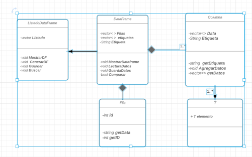

Algoritmos y estructura de datos
===============================
Trabajo final
-------------
### Equipo de trabajo
* Tiglla Arrascue Bruno
* Olaya Chauca Josue
* Ñaña Canturin Renzo

### Introducción

<em> El uso de un programa administrador de archivos consiste en utilizar de manera eficiente los datos adquiridos para utilizarlos nuevamente en proyectos actuales, por ejemplo, en listas de productos como una tienda o para almacenes. Un programa administrador de archivos es importante porque:
</em>

<ul>
	<li>Nos ayudan a buscar eficientemente</li>
	<li>Son importantes para buscar</li>
	<li>Organiza productos de distintas características</li>
	<li>Suscitan interés</li>
</ul>

### Enunciado
El trabajo final tiene por nombre FILEEXP, consiste en el desarrollo de un software explorador de archivos para el sistema operativo Windows o Linux, el cual debe implementar las características como organizar, indexar, buscar y filtrar por condiciones.
### Plan de proyecto
Para este trabajo final, aplicaremos los conocimientos adquiridos a lo largo del curso, tales como árboles binarios y algoritmos de ordenamiento y búsqueda. Este trabajo será realizado en el Lenguaje C++ y nos organizaremos gracias al uso de GitHub, donde podemos asignar responsabilidades para una fecha establecida. Gracias a esta herramienta, podemos dividir nuestro proyecto en milestones e issues y avanzar de forma más ordenada.

Nosotros esperamos que este proyecto pueda cumplir con todas las funciones y requerimientos solicitados en el tiempo establecido. Para esto debemos cumplir con el plazo de establecido para cada trabajo en GitHub.

Map in C++ Standard Template Library (STL)

	son contenedores asociativos que almacenan elementos de forma mapeada. 
	Cada elemento tiene un valor clave y un valor mapeado. 
	No hay dos valores asignados que puedan tener los mismos valores clave.

	a) Algunas funciones básicas asociadas con Map:
	begin ()
	end ()
	size ()
	max_size ()
	empty ()
	par insert (keyvalue, mapvalue)
	borrar (posición del iterador) 
	borrar (const g)
	clear ()

Data frames:
Los data frames son estructuras de datos de dos dimensiones (rectangulares)
que pueden contener datos de diferentes tipos, por lo tanto, son heterogéneas. 
Esta estructura de datos es la más usada para realizar análisis de datos
Podemos entender a los data frames como una versión más flexible de una matriz 

### Requerimientos:
*R01: El sistema debe permitir al usuario escanear archivos y carpetas en una determinada ruta.

*R02: El sistema debe permitir al usuario mostrar los datos de cada columna en el programa.

*R03: El sistema debe permitir al usuario indexar por columnas.

*R04: El sistema debe permitir al usuario Buscar por columna.

*R05: El sistema debe permitir al usuario Filtrar datos por columnas, esto considera distintas características, tales como considerando el criterio de los nombres (empieza con, termina con y contiene) o el tamaño del dato (Mayor a, menor a, igual a).

*R06: El sistema debe permitir al usuario poder ordenar la columna seleccionada.

R07: El sistema mostrará un mensaje indicando si hubo un error al momento de ingresar un dato.

R08: El sistema permite al usuario mantener actualizado el administrador de archivos, mediante nuevos registros de datos, es decir, agregando nueva información.

